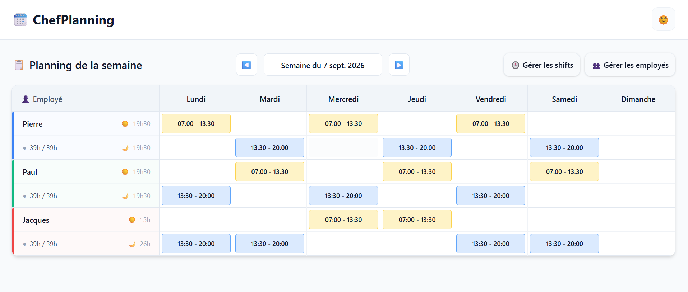

# ChefPlanning

Weekly shift planning for small retail teams — built with and for a department manager who was spending 3–4 hours a week on an Excel schedule.

**Live:** https://CHEFPLANNING-URL.vercel.app · **Status:** MVP in active development (TypeScript migration in progress)



## The problem

In small teams — a supermarket department, a tobacco shop — the weekly schedule is made by hand: Excel, paper, WhatsApp. It takes hours, and every last-minute absence means redoing it. ChefPlanning aims to make it a five-minute job, then to generate it from the team's own constraints.

## What it does today

- Employees × days grid with morning / afternoon slots
- One-click assignment from a library of shift presets; edit or remove in place
- Conflict detection (overlapping shifts are flagged)
- Shift presets CRUD — morning, afternoon, full day, split shift
- Week navigation; weekly hours per employee against their contract
- Light / dark theme; data persisted locally (no account, no backend — yet)

## Stack

React 19 · TypeScript (strict, migration in progress) · Vite · Tailwind CSS 4 (design tokens as CSS variables) · ESLint

## Architecture notes

- Feature-based structure (`features/employees`, `shifts`, `assignments`, `planning`) with barrel exports; shared `hooks/`, `utils/`, `types/`.
- State: `useReducer` + Context, persisted through a small `useLocalReducer` hook — every mutation is an action.
- Shift classification (morning / afternoon / full / split) and hours are **derived** from times, never stored twice.
- Next: assignments will **snapshot** the preset's times (editable per assignment, history stays immutable), validation with Zod, then an API (Hono), PostgreSQL, and constraint-based schedule generation.

## Roadmap (short)

1. MVP for real users — unified assignment editor, copy previous week, JSON backup, print / PDF, installable PWA
2. Fullstack — tests (Vitest), API (Hono), PostgreSQL (Drizzle), multi-team accounts
3. Scheduling engine — rules and legal checks, one-tap replacement, constraint-based generation (OR-Tools)
4. AI assistant driving the same API — "Marie is off Thursday and Friday, redo the week"

## Run locally

```bash
npm install
npm run dev      # http://localhost:5173
npm run build    # production build
npm run lint
```

## Author

Paul Alessandrini — [LinkedIn](https://www.linkedin.com/in/paul-alessandrini) · [GitHub](https://github.com/Palalde)
